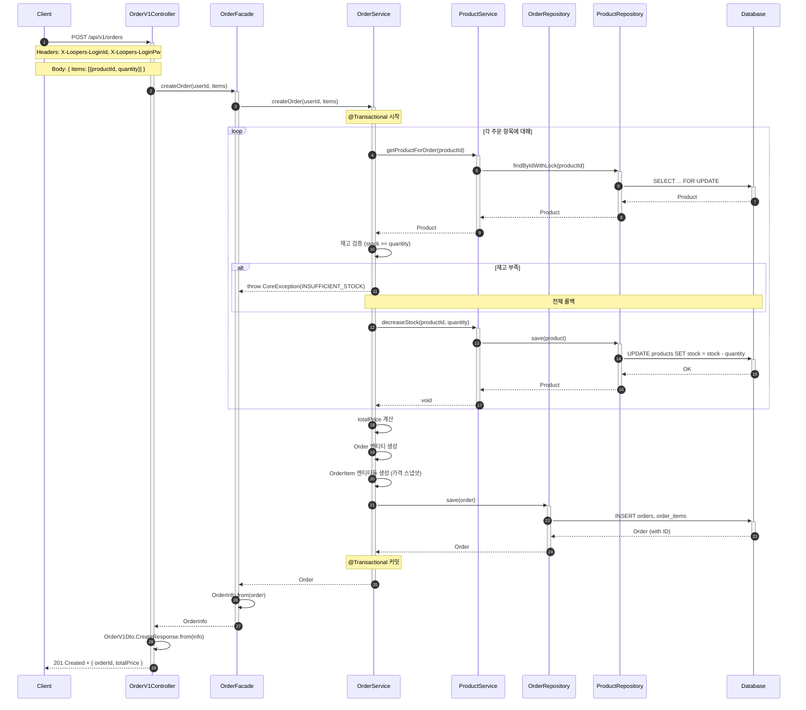
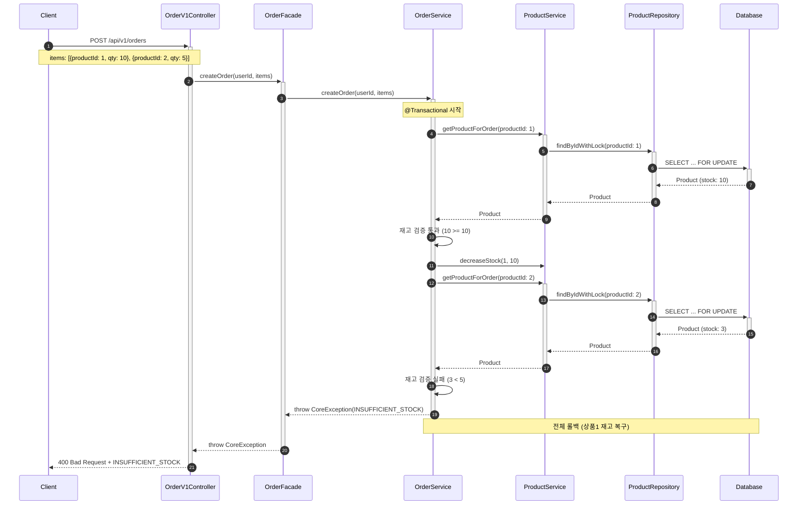
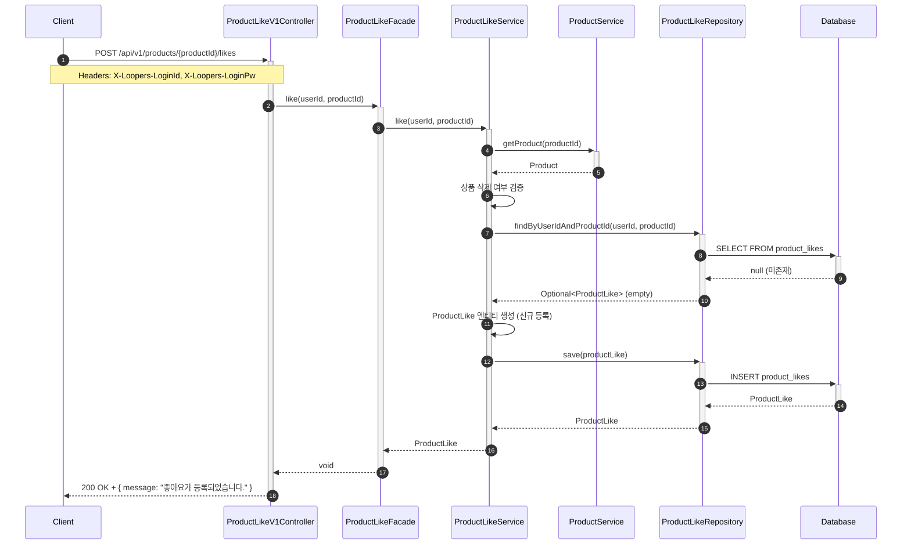
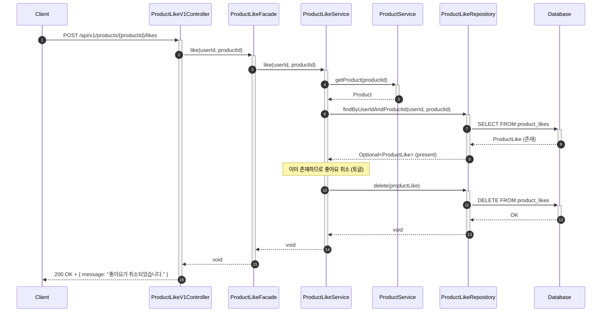
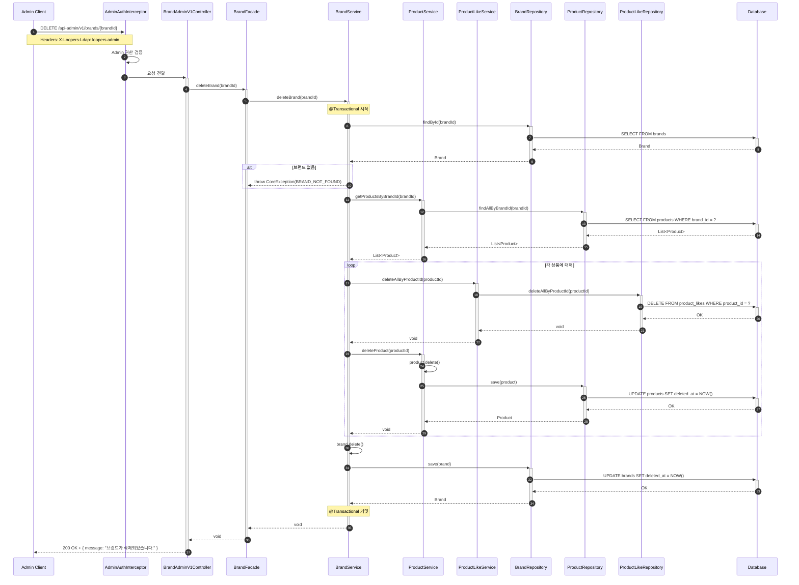
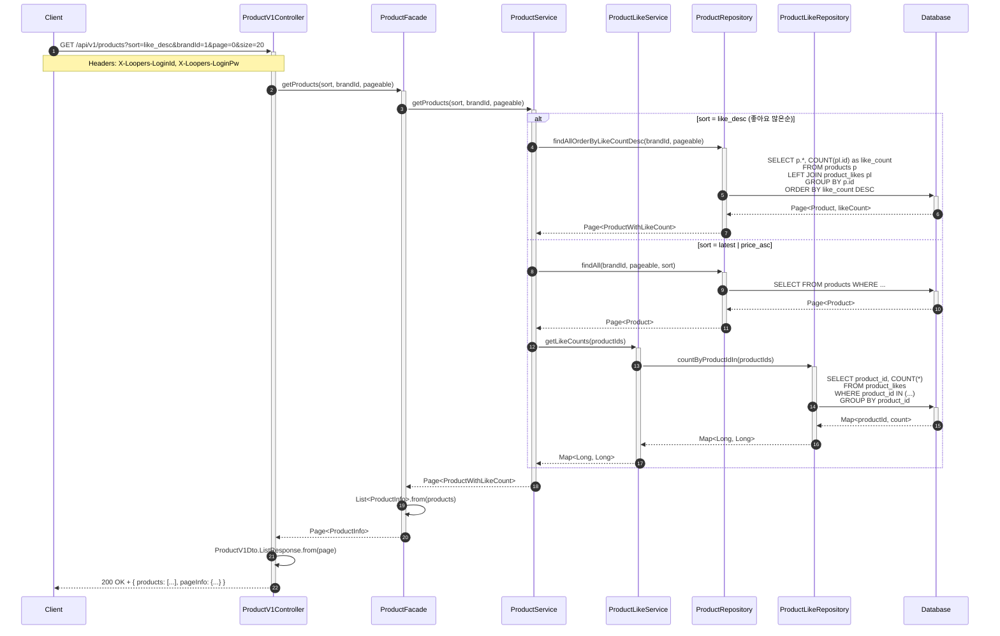
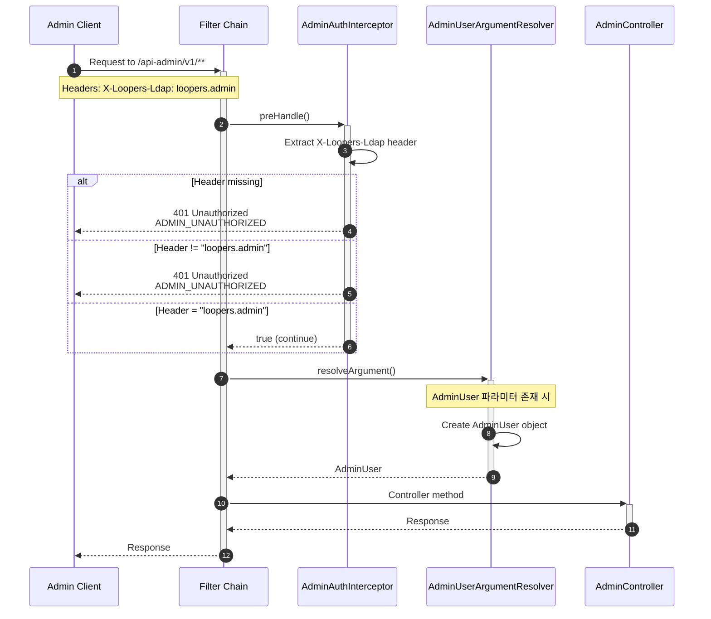

# 시퀀스 다이어그램

## 다이어그램 목적
시퀀스 다이어그램을 통해 다음을 검증한다:
- 책임 분리: 각 객체가 맡은 역할이 명확한가
- 호출 순서: 비즈니스 로직의 흐름이 올바른가
- 트랜잭션 경계: 원자성이 보장되는 범위가 적절한가

---

## 1. 주문 생성 시퀀스

### 1.1 정상 흐름 (다건 주문)

**목적**: 재고 검증, 비관적 락, 트랜잭션 경계 확인

**핵심 포인트:**
- `SELECT ... FOR UPDATE`로 비관적 락 획득 → 동시 주문 시 재고 경쟁 방지
- 모든 상품 검증 후 차감 → 하나라도 실패 시 전체 롤백
- OrderItem에 가격 스냅샷 저장 → 상품 가격 변경 시에도 주문 가격 유지

---

### 1.2 재고 부족 실패 흐름

**목적**: 전체 실패 정책, 롤백 동작 확인

**핵심 포인트:**
- 두 번째 상품 재고 부족 시 첫 번째 상품 재고 차감도 롤백
- 트랜잭션 단위로 원자성 보장

---

## 2. 좋아요 등록 시퀀스 (토글 방식)

### 2.1 신규 좋아요 등록

**목적**: 상품 유효성 검증 및 좋아요 등록 확인

**핵심 포인트:**

- *좋아요 기능 설계 시 아래와 같은 두 가지 선택지가 있었다. 정렬 쿼리를 위해 Product 내부에 좋아요 필드를 두는 방법과 좋아요 테이블을 따로 두는 선택지 중 정합성을 높이는 방식을 선택했다.*

*1. 비정규화: Product에 likeCount 필드를 두고 좋아요 등록/취소 시 동기 업데이트. 정렬 쿼리 성능 우수*

*2. 실시간 집계(적용): 좋아요 테이블에서 COUNT 집계. 정합성 높으나 정렬 시 쿼리 비용 증가*

- 상품 존재 및 삭제 여부 먼저 검증
- 기존 좋아요가 없으면 신규 등록

---

### 2.2 기존 좋아요 존재 시 (토글 - 취소 처리)

**목적**: 토글 방식 동작 확인 - 이미 좋아요가 있으면 취소

**핵심 포인트:**
- 좋아요가 이미 존재하면 삭제 (토글 방식)
- POST 요청 한 번으로 등록/취소 모두 처리

---

## 3. 브랜드 삭제 시퀀스 (Cascade 삭제)

**목적**: Cascade 삭제 순서, 트랜잭션 경계 확인

**핵심 포인트:**
- 삭제 순서: 좋아요(Hard) → 상품(Soft) → 브랜드(Soft)
- 단일 트랜잭션으로 원자성 보장
- 좋아요는 Hard Delete, 상품/브랜드는 Soft Delete

---

## 4. 상품 목록 조회 시퀀스 (좋아요 수 포함)

**목적**: 좋아요 실시간 집계, 정렬 옵션 처리 확인

**핵심 포인트:**
- `like_desc` 정렬 시 JOIN + COUNT로 한 번에 조회
- 다른 정렬 시 상품 조회 후 좋아요 수 별도 조회 (N+1 방지를 위해 IN 쿼리 사용)
- *쿠팡과 오늘의 집에서 하듯이, 주문 목록 조회 시 기간(startAt, endAt)으로 조회하는 방안을 검토해 보았으나 설계에 집중하기 위해 넣지 않았다.*
---

## 5. 어드민 인증 흐름

**목적**: Interceptor + ArgumentResolver 조합 확인

**핵심 포인트:**
- Interceptor가 1차 방어선 (헤더 누락/불일치 시 401)
- ArgumentResolver는 컨트롤러에 AdminUser 객체 주입
- 이중 안전장치로 보안성 강화
- *Interceptor 방식은 컨트롤러에서 어드민 정보 접근 시 Request에서 다시 추출 필요하고 특정 메서드만 예외 처리하려면 추가 로직 필요한 문제*
- *ArgumentResolver는 모든 메서드에 @AdminAuth 파라미터 추가 필요하고, 실수로 어노테이션을 누락하면 보안 위험한 문제*

*-> Interceptor + ArgumentResolver 조합으로 문제를 해결했다.*