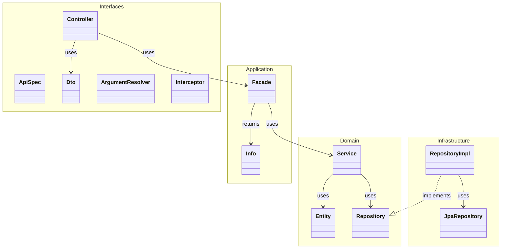
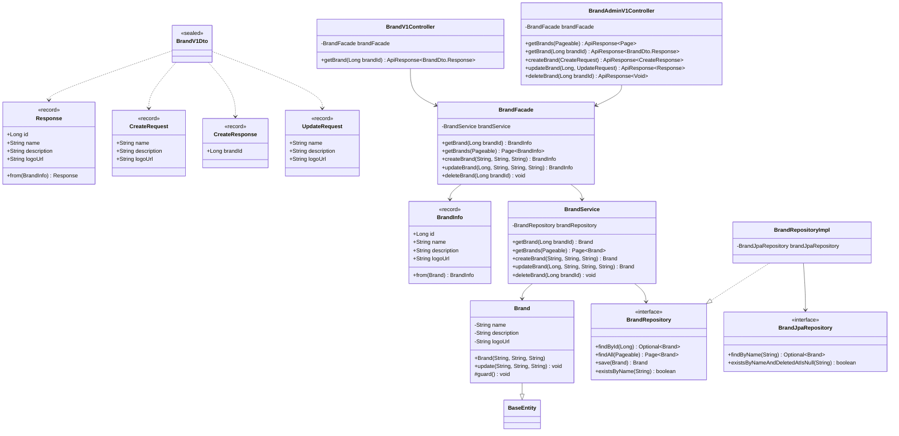
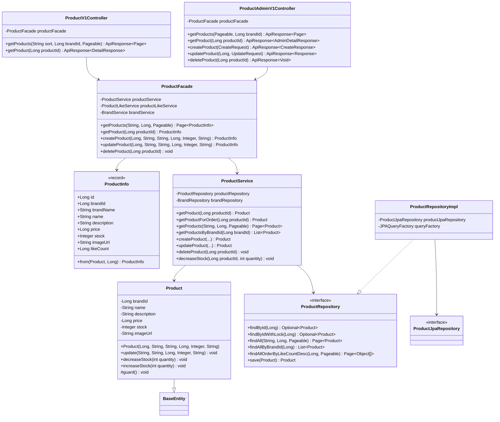
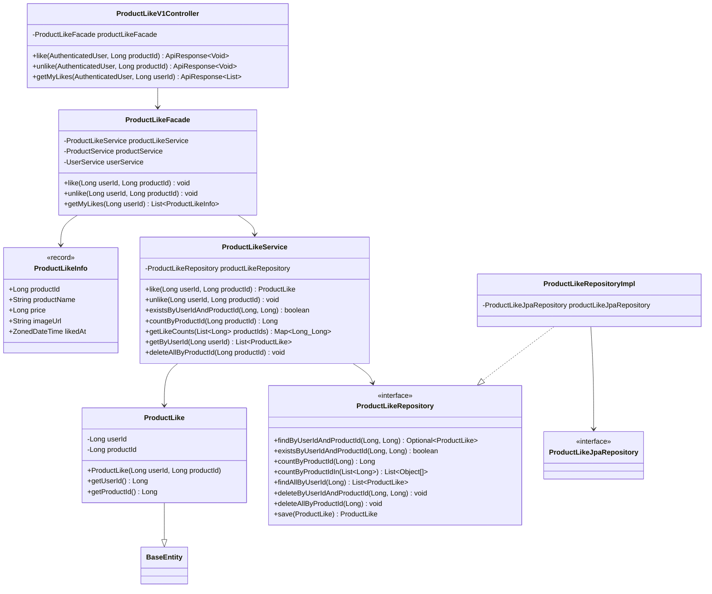
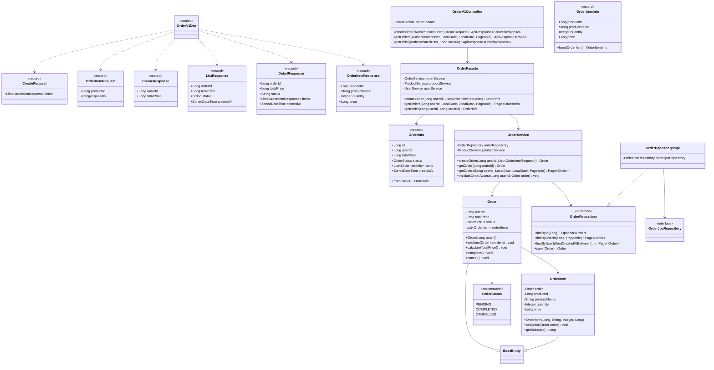
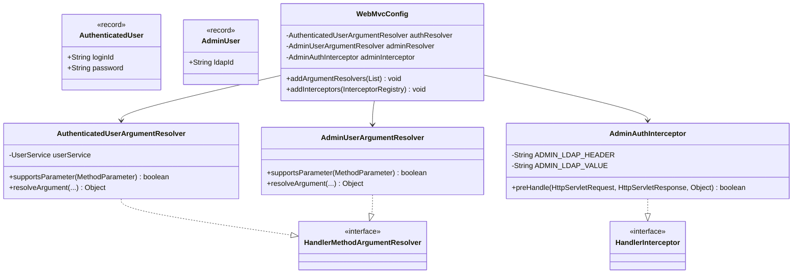
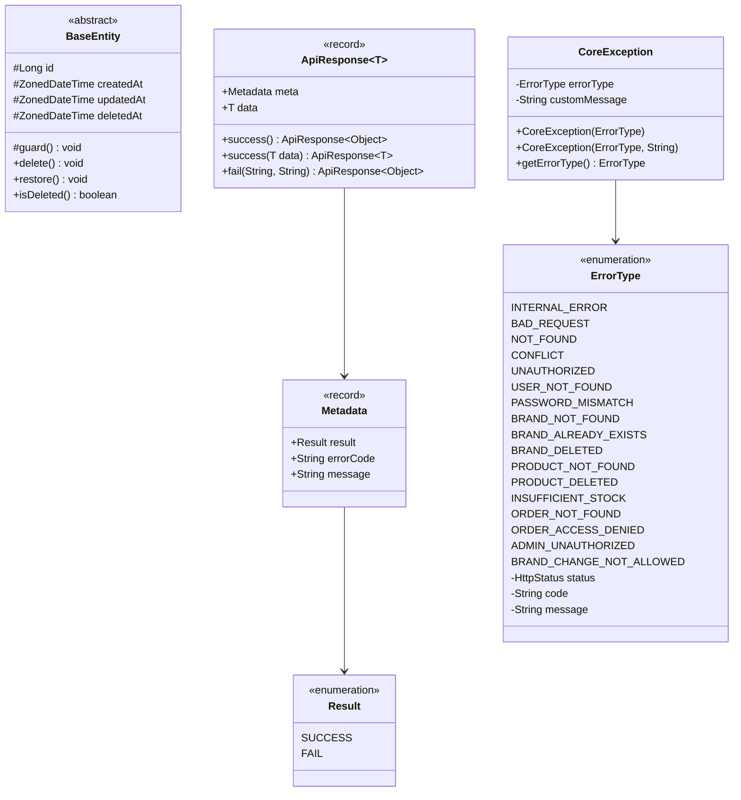

# 클래스 다이어그램

## 다이어그램 목적
클래스 다이어그램을 통해 다음을 검증한다:
- 도메인 책임: 각 도메인의 역할이 명확한가
- 의존 방향: 상위 계층이 하위 계층에만 의존하는가
- 응집도: 관련 기능이 적절히 그룹화되어 있는가

---

## 1. 전체 계층 구조 개요

**계층별 책임:**
- **Interfaces**: HTTP 요청/응답 처리, DTO 변환, 인증 처리
- **Application**: 유스케이스 조율, 도메인 ↔ 프레젠테이션 변환
- **Domain**: 비즈니스 로직, 엔티티 검증, 도메인 규칙
- **Infrastructure**: 데이터 접근, 외부 시스템 연동

---

## 2. Brand 도메인 클래스

---

## 3. Product 도메인 클래스

---

## 4. ProductLike 도메인 클래스

---

## 5. Order 도메인 클래스

---

## 6. 인증 관련 클래스

**핵심 포인트:**
- **AdminAuthInterceptor**: `/api-admin/**` 경로에 대해 헤더 검증 (1차 방어선)
- **AdminUserArgumentResolver**: 컨트롤러에 AdminUser 객체 주입

---

## 7. 공통 클래스

**핵심 포인트:**
- **BaseEntity**: 모든 엔티티의 공통 필드 (id, timestamps, soft delete)
- **ApiResponse**: 통일된 API 응답 형식
- **ErrorType**: 도메인별 에러 코드 정의