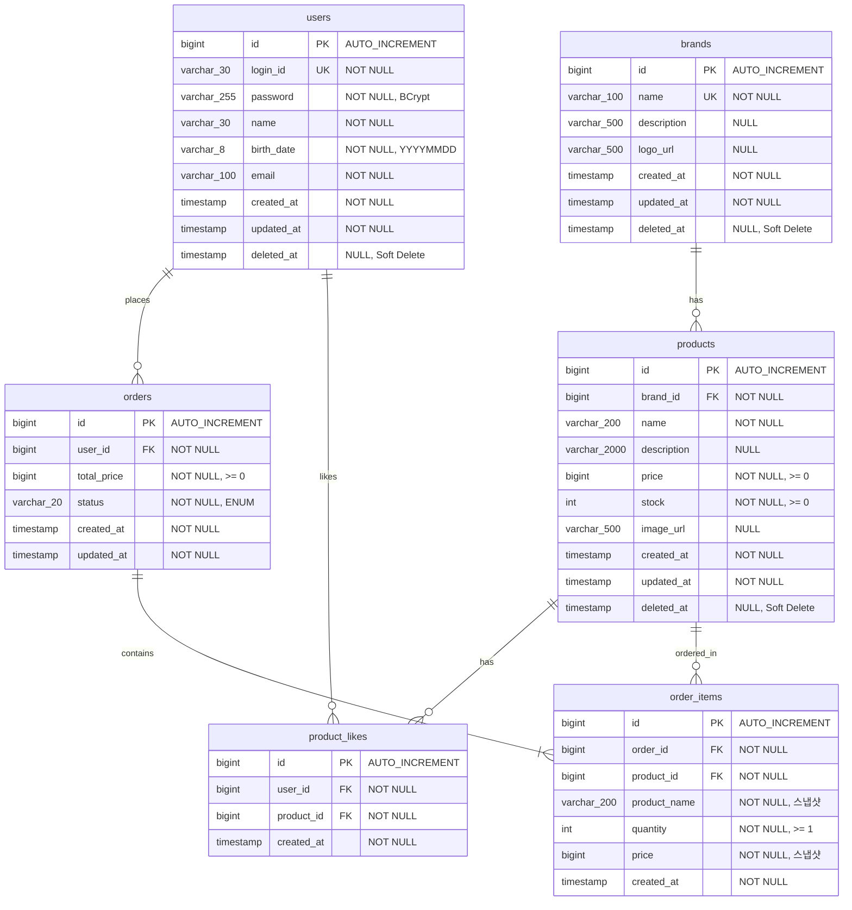

# ERD (Entity Relationship Diagram)

## 다이어그램 목적
ERD를 통해 다음을 검증한다:
- 영속성 구조: 데이터가 어떻게 저장되는가
- 관계의 주인: FK가 어디에 위치하는가
- 정규화 여부: 데이터 중복이 최소화되었는가
- 정합성: 제약조건이 비즈니스 규칙을 반영하는가

---

## 1. 전체 ERD



---

## 2. 테이블 상세 스키마

### 2.1 users 테이블 (기존)

```sql
CREATE TABLE users (
    id BIGINT AUTO_INCREMENT PRIMARY KEY,
    login_id VARCHAR(30) NOT NULL,
    password VARCHAR(255) NOT NULL,
    name VARCHAR(30) NOT NULL,
    birth_date VARCHAR(8) NOT NULL,
    email VARCHAR(100) NOT NULL,
    created_at TIMESTAMP NOT NULL DEFAULT CURRENT_TIMESTAMP,
    updated_at TIMESTAMP NOT NULL DEFAULT CURRENT_TIMESTAMP ON UPDATE CURRENT_TIMESTAMP,
    deleted_at TIMESTAMP NULL,

    CONSTRAINT uk_users_login_id UNIQUE (login_id)
) ENGINE=InnoDB DEFAULT CHARSET=utf8mb4 COLLATE=utf8mb4_unicode_ci;
```

---

### 2.2 brands 테이블

```sql
CREATE TABLE brands (
    id BIGINT AUTO_INCREMENT PRIMARY KEY,
    name VARCHAR(100) NOT NULL,
    description VARCHAR(500) NULL,
    logo_url VARCHAR(500) NULL,
    created_at TIMESTAMP NOT NULL DEFAULT CURRENT_TIMESTAMP,
    updated_at TIMESTAMP NOT NULL DEFAULT CURRENT_TIMESTAMP ON UPDATE CURRENT_TIMESTAMP,
    deleted_at TIMESTAMP NULL,

    CONSTRAINT uk_brands_name UNIQUE (name)
) ENGINE=InnoDB DEFAULT CHARSET=utf8mb4 COLLATE=utf8mb4_unicode_ci;

-- 인덱스
CREATE INDEX idx_brands_deleted_at ON brands (deleted_at);
CREATE INDEX idx_brands_created_at ON brands (created_at);
```

**인덱스 설계 의도:**
| 인덱스 | 용도 |
|--------|------|
| `uk_brands_name` | 브랜드명 중복 방지 |
| `idx_brands_deleted_at` | Soft Delete 필터링 최적화 |
| `idx_brands_created_at` | 최신순 정렬 최적화 |

---

### 2.3 products 테이블

```sql
CREATE TABLE products (
    id BIGINT AUTO_INCREMENT PRIMARY KEY,
    brand_id BIGINT NOT NULL,
    name VARCHAR(200) NOT NULL,
    description VARCHAR(2000) NULL,
    price BIGINT NOT NULL,
    stock INT NOT NULL DEFAULT 0,
    image_url VARCHAR(500) NULL,
    created_at TIMESTAMP NOT NULL DEFAULT CURRENT_TIMESTAMP,
    updated_at TIMESTAMP NOT NULL DEFAULT CURRENT_TIMESTAMP ON UPDATE CURRENT_TIMESTAMP,
    deleted_at TIMESTAMP NULL,

    CONSTRAINT fk_products_brand_id FOREIGN KEY (brand_id)
        REFERENCES brands(id) ON DELETE RESTRICT,

    CONSTRAINT chk_products_price CHECK (price >= 0),
    CONSTRAINT chk_products_stock CHECK (stock >= 0)
) ENGINE=InnoDB DEFAULT CHARSET=utf8mb4 COLLATE=utf8mb4_unicode_ci;

-- 인덱스
CREATE INDEX idx_products_brand_id ON products (brand_id);
CREATE INDEX idx_products_deleted_at ON products (deleted_at);
CREATE INDEX idx_products_price ON products (price);
CREATE INDEX idx_products_created_at ON products (created_at DESC);

-- 복합 인덱스: 브랜드별 상품 조회 최적화
CREATE INDEX idx_products_brand_deleted_created
    ON products (brand_id, deleted_at, created_at DESC);
```

**인덱스 설계 의도:**
| 인덱스 | 용도 |
|--------|------|
| `fk_products_brand_id` | 브랜드-상품 관계 무결성 |
| `idx_products_brand_id` | 브랜드별 상품 조회 |
| `idx_products_deleted_at` | Soft Delete 필터링 |
| `idx_products_price` | 가격순 정렬 최적화 |
| `idx_products_created_at` | 최신순 정렬 최적화 |
| `idx_products_brand_deleted_created` | 브랜드 필터 + 삭제 필터 + 최신순 복합 쿼리 |

---

### 2.4 product_likes 테이블

```sql
CREATE TABLE product_likes (
    id BIGINT AUTO_INCREMENT PRIMARY KEY,
    user_id BIGINT NOT NULL,
    product_id BIGINT NOT NULL,
    created_at TIMESTAMP NOT NULL DEFAULT CURRENT_TIMESTAMP,

    CONSTRAINT fk_product_likes_user_id FOREIGN KEY (user_id)
        REFERENCES users(id) ON DELETE CASCADE,
    CONSTRAINT fk_product_likes_product_id FOREIGN KEY (product_id)
        REFERENCES products(id) ON DELETE CASCADE,

    CONSTRAINT uk_product_likes_user_product UNIQUE (user_id, product_id)
) ENGINE=InnoDB DEFAULT CHARSET=utf8mb4 COLLATE=utf8mb4_unicode_ci;

-- 인덱스
CREATE INDEX idx_product_likes_product_id ON product_likes (product_id);
CREATE INDEX idx_product_likes_user_id ON product_likes (user_id);
```

**인덱스 설계 의도:**
| 인덱스 | 용도 |
|--------|------|
| `uk_product_likes_user_product` | 중복 좋아요 방지 + 특정 사용자의 특정 상품 좋아요 여부 조회 |
| `idx_product_likes_product_id` | 상품별 좋아요 수 COUNT 최적화 |
| `idx_product_likes_user_id` | 사용자별 좋아요 목록 조회 최적화 |

**CASCADE 삭제:**
- User 삭제 시 해당 사용자의 좋아요 자동 삭제
- Product 삭제 시 해당 상품의 좋아요 자동 삭제

---

### 2.5 orders 테이블

```sql
CREATE TABLE orders (
    id BIGINT AUTO_INCREMENT PRIMARY KEY,
    user_id BIGINT NOT NULL,
    total_price BIGINT NOT NULL DEFAULT 0,
    status VARCHAR(20) NOT NULL DEFAULT 'COMPLETED',
    created_at TIMESTAMP NOT NULL DEFAULT CURRENT_TIMESTAMP,
    updated_at TIMESTAMP NOT NULL DEFAULT CURRENT_TIMESTAMP ON UPDATE CURRENT_TIMESTAMP,

    CONSTRAINT fk_orders_user_id FOREIGN KEY (user_id)
        REFERENCES users(id) ON DELETE RESTRICT,

    CONSTRAINT chk_orders_total_price CHECK (total_price >= 0),
    CONSTRAINT chk_orders_status CHECK (status IN ('PENDING', 'COMPLETED', 'CANCELLED'))
) ENGINE=InnoDB DEFAULT CHARSET=utf8mb4 COLLATE=utf8mb4_unicode_ci;

-- 인덱스
CREATE INDEX idx_orders_user_id ON orders (user_id);
CREATE INDEX idx_orders_created_at ON orders (created_at DESC);
CREATE INDEX idx_orders_status ON orders (status);

-- 복합 인덱스: 사용자별 기간 조회 최적화
CREATE INDEX idx_orders_user_created ON orders (user_id, created_at DESC);
```

**인덱스 설계 의도:**
| 인덱스 | 용도 |
|--------|------|
| `idx_orders_user_id` | 사용자별 주문 조회 |
| `idx_orders_created_at` | 최신순 정렬 |
| `idx_orders_status` | 상태별 필터링 |
| `idx_orders_user_created` | 사용자의 주문 기간 조회 최적화 |

---

### 2.6 order_items 테이블

```sql
CREATE TABLE order_items (
    id BIGINT AUTO_INCREMENT PRIMARY KEY,
    order_id BIGINT NOT NULL,
    product_id BIGINT NOT NULL,
    product_name VARCHAR(200) NOT NULL COMMENT '주문 시점 상품명 스냅샷',
    quantity INT NOT NULL,
    price BIGINT NOT NULL COMMENT '주문 시점 상품 가격 스냅샷',
    created_at TIMESTAMP NOT NULL DEFAULT CURRENT_TIMESTAMP,

    CONSTRAINT fk_order_items_order_id FOREIGN KEY (order_id)
        REFERENCES orders(id) ON DELETE CASCADE,
    CONSTRAINT fk_order_items_product_id FOREIGN KEY (product_id)
        REFERENCES products(id) ON DELETE RESTRICT,

    CONSTRAINT uk_order_items_order_product UNIQUE (order_id, product_id),
    CONSTRAINT chk_order_items_quantity CHECK (quantity >= 1),
    CONSTRAINT chk_order_items_price CHECK (price >= 0)
) ENGINE=InnoDB DEFAULT CHARSET=utf8mb4 COLLATE=utf8mb4_unicode_ci;

-- 인덱스
CREATE INDEX idx_order_items_order_id ON order_items (order_id);
CREATE INDEX idx_order_items_product_id ON order_items (product_id);
```

**인덱스 설계 의도:**
| 인덱스 | 용도 |
|--------|------|
| `uk_order_items_order_product` | 동일 주문 내 동일 상품 중복 방지 |
| `idx_order_items_order_id` | 주문별 항목 조회 |
| `idx_order_items_product_id` | 상품별 주문 이력 조회 |

**가격/상품명 스냅샷:**
- `price`, `product_name` 필드는 주문 시점의 값을 저장
- 상품 가격/이름 변경 시에도 기존 주문의 정보는 유지

---

## 3. 관계 정의

### 3.1 관계 요약

| 관계 | 타입 | 설명 |
|------|------|------|
| users : orders | 1:N | 사용자는 여러 주문 가능 |
| users : product_likes | 1:N | 사용자는 여러 상품에 좋아요 가능 |
| brands : products | 1:N | 브랜드는 여러 상품 보유 |
| products : product_likes | 1:N | 상품은 여러 좋아요 보유 |
| products : order_items | 1:N | 상품은 여러 주문에 포함 가능 |
| orders : order_items | 1:N | 주문은 여러 주문 항목 포함 |

### 3.2 FK 삭제 정책

| FK | 정책 | 이유 |
|----|------|------|
| products.brand_id | RESTRICT | 브랜드 삭제 시 애플리케이션에서 Cascade 처리 |
| product_likes.user_id | CASCADE | 사용자 삭제 시 좋아요 자동 삭제 |
| product_likes.product_id | CASCADE | 상품 삭제 시 좋아요 자동 삭제 |
| orders.user_id | RESTRICT | 주문 이력 보존 (사용자 삭제 불가) |
| order_items.order_id | CASCADE | 주문 삭제 시 항목 자동 삭제 |
| order_items.product_id | RESTRICT | 상품 삭제 시에도 주문 이력 보존 |

---

## 4. 쿼리 최적화 가이드

### 4.1 상품 목록 조회 (좋아요순 정렬)

```sql
-- 좋아요 많은순 정렬 (서브쿼리 방식)
SELECT
    p.*,
    COALESCE(like_counts.cnt, 0) as like_count
FROM products p
LEFT JOIN (
    SELECT product_id, COUNT(*) as cnt
    FROM product_likes
    GROUP BY product_id
) like_counts ON p.id = like_counts.product_id
WHERE p.deleted_at IS NULL
    AND (p.brand_id = :brandId OR :brandId IS NULL)
ORDER BY like_count DESC, p.created_at DESC
LIMIT :limit OFFSET :offset;
```

### 4.2 재고 차감 (비관적 락)

```sql
-- 비관적 락으로 재고 조회
SELECT * FROM products
WHERE id = :productId AND deleted_at IS NULL
FOR UPDATE;

-- 재고 검증 후 차감
UPDATE products
SET stock = stock - :quantity, updated_at = NOW()
WHERE id = :productId AND stock >= :quantity;
```

### 4.3 주문 상세 조회 (Fetch Join)

```sql
SELECT o.*, oi.*
FROM orders o
JOIN order_items oi ON o.id = oi.order_id
WHERE o.id = :orderId AND o.user_id = :userId;
```

### 4.4 사용자별 좋아요 상품 목록

```sql
SELECT p.*, pl.created_at as liked_at
FROM product_likes pl
JOIN products p ON pl.product_id = p.id
WHERE pl.user_id = :userId AND p.deleted_at IS NULL
ORDER BY pl.created_at DESC;
```

### 4.5 사용자 주문 기간 조회

```sql
SELECT o.*, oi.*
FROM orders o
LEFT JOIN order_items oi ON o.id = oi.order_id
WHERE o.user_id = :userId
    AND (:startAt IS NULL OR o.created_at >= :startAt)
    AND (:endAt IS NULL OR o.created_at < :endAt + INTERVAL 1 DAY)
ORDER BY o.created_at DESC
LIMIT :limit OFFSET :offset;
```

---

## 5. 데이터 마이그레이션 순서

```
V1__Create_users_table.sql (기존)
V2__Create_brands_table.sql
V3__Create_products_table.sql
V4__Create_product_likes_table.sql
V5__Create_orders_table.sql
V6__Create_order_items_table.sql
V7__Add_indexes.sql
```

---

## 6. 데이터 정합성 고려사항

### 6.1 동시성 제어
- **재고 차감**: `SELECT ... FOR UPDATE` 비관적 락
- **좋아요 중복**: `UNIQUE (user_id, product_id)` 제약조건
- **주문 항목 중복**: `UNIQUE (order_id, product_id)` 제약조건

### 6.2 Soft Delete 처리
- brands, products, users: `deleted_at` 필드 사용
- 조회 시 `WHERE deleted_at IS NULL` 조건 필수
- product_likes, orders, order_items: Hard Delete

### 6.3 스냅샷 데이터
- order_items.price: 주문 시점 상품 가격
- order_items.product_name: 주문 시점 상품명
- 상품 정보 변경과 무관하게 주문 이력 보존